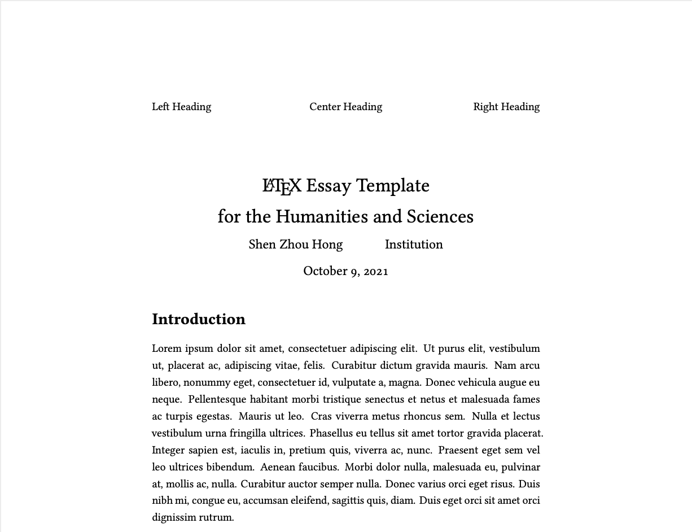

# Basic LaTeX Essay Template
This is an LaTeX essay template that's fairly useful for writing essays in the
humanities (i.e. philosophy, history). It's configured to use biblatex for
citation management, and outputs citations (as well as inline citations) in the
MLA format.



It is designed to be modular, with the mains scaffold of the template located at
`latex/essay-name.tex`, which falls in additional includes at `latex/includes`,
and content at `latex/sections`. This way, when working on relatively longer
essays, one can have all the textual content organized as multiple files in the
`latex/sections` folder, and have any custom formatting applied through the
`latex/includes` folder.

Additionally, the base folder of the repository is designed to be a good place
for sources, notes, as well as other secondary information used in the essay
writing process. This way, these files can be tracked into version-control as
well.

## Quickstart
In order to customize this LaTeX template file to your project, simply rename
the `essay-name.tex` file, and than edit the the included makefile to point at
the right file again:

### makefile
```
# Makefile for latexmk
source_name = essay-name
```
### Compiling document
In order to compile latex source files, run `make` in the terminal:
```
cd latex
make
make clean
```

Note: for any partial compiles where compilation fails at a certain point, you
should run `make clean` followed by make again. Trying to run make after a
failed compile would result in additional errors.

### Dependencies
This template uses a makefile to compile the latex source files. The makefile
uses `latexmk`, which runs latex the correct number of times. This is because
due to the presense of figures, tables, and biblatex databases, latex needs to
be called multiple times in some cases. Latexmk should be included in your
latex installation, but if it is now, you may download it here:

* http://personal.psu.edu/jcc8//software/latexmk-jcc/

Additionally, this template uses XeLaTeX by default, as it allows the inclusion
of unicode characters in the latex source files. If XeLaTeX is not installed, or
plain LaTeX is required, simply alter the `makefile` at the appropriate call:

```
# MAIN LATEXMK RULE
$(source_name).pdf: $(source_name).tex
  ...
	latexmk -pdf -xelatex -use-make $<
```

XeLaTeX allows one to use foreign characters like ü or æ natively in the latex
source files, though. So it's probably a good idea to install XeLaTeX:

* http://xetex.sourceforge.net/

### Related documentation
For an overview of how to populate biblatex `citations.bib` files, visit the
biblatex-mla manual at CTAN.

* https://www.ctan.org/pkg/biblatex-mla

### GPLv3 License
The raw template itself is licensed under the terms of the GPL (version 3). A
full copy of the license is attached in `LICENSE.md`. Naturally, any works
that you create using this template (i.e. any actual essays you write using
it) will be your own intellectual property. The GPLv3 license only applies to
any derivative templates.
