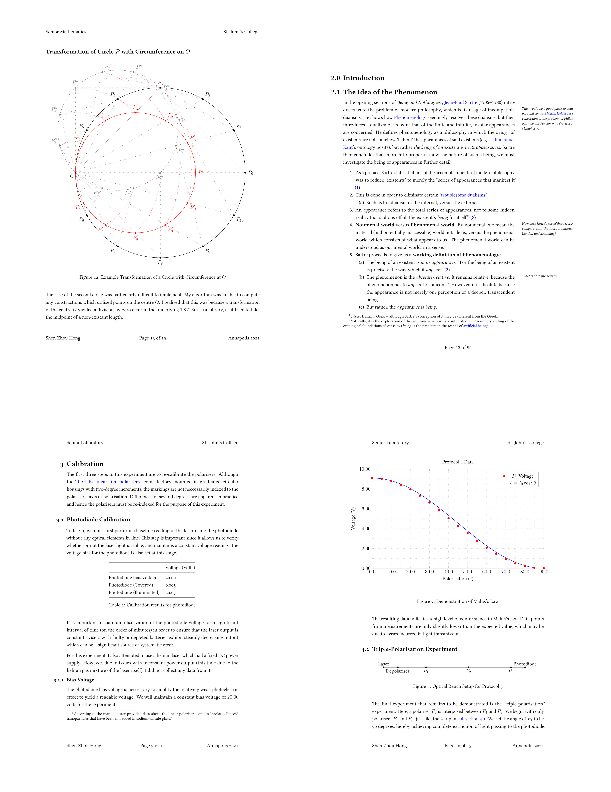

# Shen's LaTeX Essay Template
This is my LaTeX Essay Template. It is a best-in-class LuaLaTeX template for writing essays, dissertations, documents, and papers in the academic humanities. It includes a custom LaTeX `documentclass` called `humanize`, which is based off the `article` class, and contains all of the custom styling and configuration.



## Features
This template uses a number of advanced LaTeX features.

* Complete **PDF/A-3u Compatibility**, for Archival Grade Documents.
* **Fully Reproducible Builds** for PDF Compilation, using Makefile.
* **Custom Microtype Protrusion** Settings for Hanging Punctuation.
* **Typography Tweaks**, Adjustments, and Custom Headers and Footers.
* **BibLaTeX Integration** for Citation Management

## Quickstart
This git repository is set as a template. Simply clone the template, and begin. The root document is located at `./latex/paper.tex`. The `documentclass`, `\Title`, `\Author`, and `\Date` fields can be modified there.


To compile the document, simply run `make`:

```
make
```

## Documentation
This template is broadly organized into two directories. `sections` contain the body of the text. `figures` contains additional templates for figures, diagrams, and graphs. 

```
.
├── collage-4.jpg
├── latex
│   ├── figures
│   │   └── template-*.tex
│   ├── humanize.cls
│   ├── betterprotrusionboundary.lua
│   ├── configuration.tex
│   ├── mt-protrusion.cfg
│   ├── citations.bib
│   ├── paper.pdf
│   ├── paper.tex
│   ├── paper.xmpdata
│   ├── makefile
│   └── sections
│       ├── body.tex
│       └── endpage.tex
├── LICENSE.md
├── makefile
└── README.md

```

The body of the text is meant to be included in the `./latex/sections` directory. Begin writing in `./latex/sections/body.tex`, and add additional sections within that directory (e.g. `./latex/sections/introduction.tex`).

Metadata for the PDF must be configured in the `./latex/paper.xmpdata` file. This file is read by the `pdfx` package, and information within is used to generate a valid, standard-conformant PDF/A-3u document.

The header, footer, and additional packages can be configured in `./latex/configurations.tex`. Biblatex, as well as a set of commonly used packages for mathematics and sciences are included as comments.

## Dependencies
This template depends on the following programs:

* GNU Make: Used for the makefile for compiling the PDF document
* Latexmk: Tool used with Make to run LaTeX for the correct number of runs.
* LuaLaTeX: The default typesetting engine used.
* Microtype version >= `3.0`. This template uses advanced protrusion features only available in recent versions of microtype.

## Related documentation
For an overview of how to populate biblatex `citations.bib` files, visit the
biblatex-mla manual at CTAN.

* https://www.ctan.org/pkg/biblatex-mla

## GPLv3 License
The raw template itself is licensed under the terms of the GPL (version 3). A
full copy of the license is attached in `LICENSE.md`. Naturally, any works
that you create using this template (i.e. any actual essays you write using
it) will be your own intellectual property.